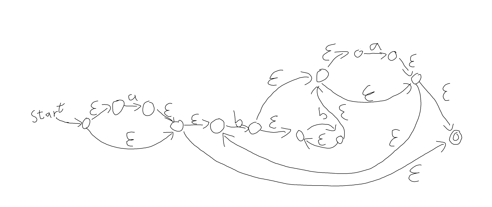

# 3.2
## Regex
```
a?(b+a?)*
```
## NFA



## DFA

| State (DFA) | Move (a) | Move (b) | State (NFA) |
|:---------:|:------:|:------:|:---------:|
| $S_0$  | $S_1$ | $S_2$ | $S_0 = \{ 0,1,3,4,\underline{12} \}$ |
| $S_1$| $\{\}$ | $S_2$| $S_1 = \{ 2,3,4,\underline{12} \}$|
| $S_2$| $S_3$| $S_4$| $S_2 = \{ 5,6,8,9,11,4,\underline{12} \}$|
| $S_3$ | $\{\}$| $S_2$| $S_3 = \{ 10,11,4,\underline{12} \}$|
| $S_4$ | $S_3$ | $S_4$| $S_4 = \{7,6,8,9,11,4,\underline{12} \}$|


