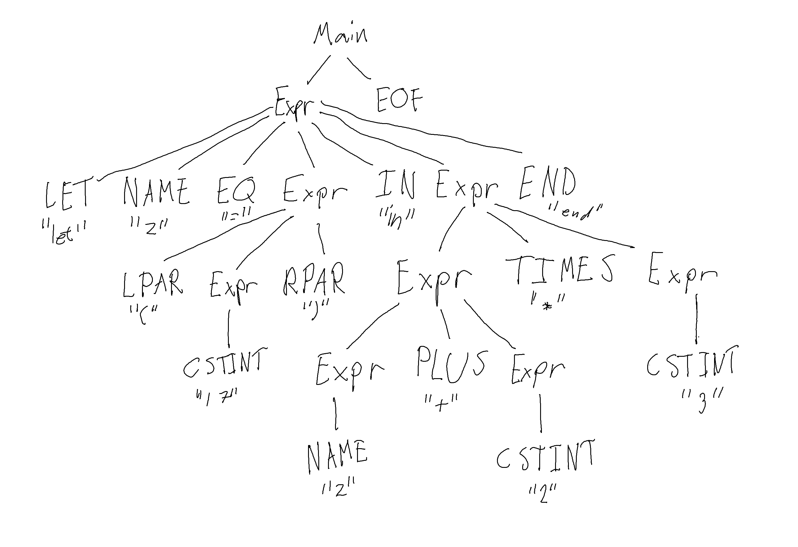

# 3.3
let z = (17) in z + 2 * 3 end EOF

```
Main (A)=> 
Expr EOF (F)=> 
LET NAME EQ Expr IN Expr END EOF(G)=> 
LET NAME EQ Expr IN Expr TIMES Expr END EOF (C)=> 
LET NAME EQ Expr IN Expr TIMES CSTINT END EOF (H) => 
LET NAME EQ Expr IN Expr PLUS Expr TIMES CSTINT END EOF (C)=> 
LET NAME EQ Expr IN Expr PLUS CSTINT TIMES CSTINT END EOF (B)=> 
LET NAME EQ Expr IN NAME PLUS CSTINT TIMES CSTINT END EOF (E)=> 
LET NAME EQ LPAR Expr RPAR IN NAME PLUS CSTINT TIMES CSTINT END EOF (C)=> 
LET NAME EQ LPAR CSTINT RPAR IN NAME PLUS CSTINT TIMES CSTINT END EOF
```

# 3.4
