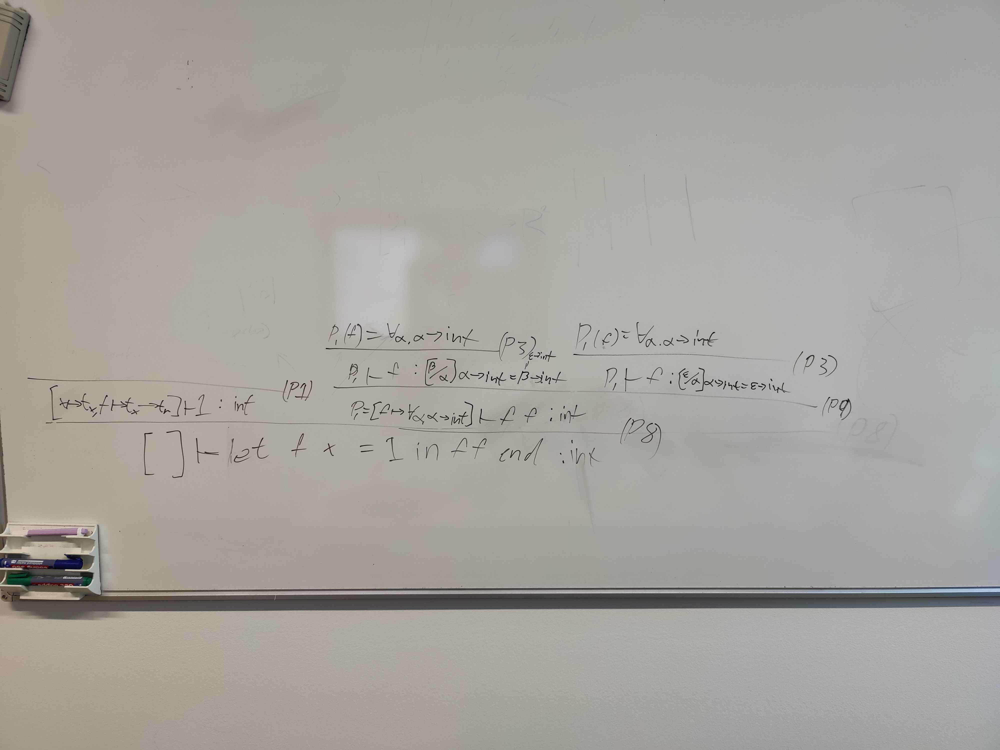
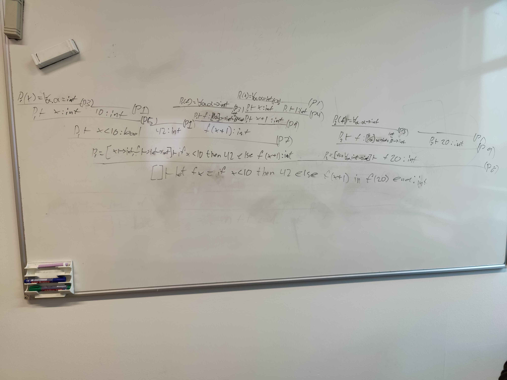

# Exercise 5.1 (Implement merge in F# and Java)
The function **merge** is implemented separately using F# and Java (**merge.fs** and **merge.java**, respectively). 

# Exercise 5.7 (Extend the monomorphic type checker to deal with lists)
Done 
Can be found in `TypedFun.fs`

# Exercise 6.1 (Download/unpack fun1.zip, fun2.zip. Build the micro-ML higher-order evaluator)
3 does indeed run as expected because the value of `x` in the closure for the function `addtwo` is set to the value we gave `x` when defining `addtwo` to be `add 2` thusly the `let x = 77` does not change the value within the confines of the function `addtwo` I HEREBY DECLARE!!!!

The reason that 4 gives us a closure is that we call `add` with one arguments setting the `x` variable in the environment. The body of `add` is the function of `f` which is all we get back because we then don't call f with any arguments. 

# Exercise 6.2 (Add anonymous functions)
**eval** can now evaluate such anonymous functions.

# Exercise 6.3 (Extend the micro-ML lexer and parser specifications to permit anonymous functions)
Done.

# Exercise 6.4

# Exercise 6.5
## Part 1:
```
let f x = 1
in f f end
```
Types to `int`


Expressions not typable`

```
let f g = g g
in f end
```
Is ill typed because of the finite non circular rule of polymorphism. Since g calls g we get a circular loop = bad

```
let f x =
    let g y = y
    in g false end
in f 42 end
```
Types to `bool` 

```
let f x =
    let g y = if true then y else x
    in g false end
in f 42 end
```
Is ill typed because  
> "A type parameter that is used in an enclosing scope cannot be generalized"

meaning that x and y would have to be the same type since otherwise would have two different return types. In this case y is a bool and x is an int which makes no sense.

```
let f x =
    let g y = if true then y else x
    in g false end
in f true end
```
Types to `bool`

## Part 2:

`bool -> bool`
```
let f x = if x then x else x in f end
```  
Types to `bool -> bool` = success

`int -> int`
```
let f x = x + x in f end
```
Types to `int -> int` = success

`int -> int -> int`
```
let f x = 
    let g y = x+y 
    in g end
in f end
```
Types to `int -> (int -> int)` = success

`'a -> 'b -> 'a`
```
let f x = 
    let g y = x
    in g end
in f end 
```
Type to `'h -> ('g -> 'h)` = success

`'a -> 'b -> 'b`
```
let f x =
    let g y = y
    in g end
in f end
```
Type to `'g -> ('h -> 'h)` = success

`('a -> 'b) -> ('b -> 'c) -> ('a -> 'c)`
```
let f x =
    let g y =
        let h z = y (x z)
        in h end
    in g end
in f end
```
Types to `('l -> 'k) -> ('k -> 'm) -> ('l -> 'm)` = success 


`'a -> 'b`
```
let f x = f x in f end
```
Types to `'e -> 'f` = success


`'a`
```
let f x = f x in let g y = y in f g end end
```
Types to `'h` = success

# Type rule tree proofs

$$ \frac{\frac{}
{[x \mapsto t_x , f \mapsto t_x \mapsto t_r] \vdash 1 \text{: int}} \quad (P1) \qquad 
\frac{\frac{P_1 (f) = \forall \alpha , \alpha \rightarrow \text{int}}
{P_1 \vdash f : [\beta / \alpha] \alpha \rightarrow \text{int} = \beta \rightarrow \text{int}} \quad (P3) \qquad \frac{P_1 (f) = \forall \alpha . \alpha \rightarrow \text{int}}
{P_1 \vdash f \text{:} [\epsilon / \alpha] \alpha \rightarrow \text{int} = \epsilon \rightarrow \text{int}} \quad (P3) }
{P_1 = [f\vdash \forall \alpha , \alpha \rightarrow \text{int}] \vdash \text{ff : int}} \quad (P9)}{[] \vdash \text{let } (f x) = 1 \text{ in } ff \text{ end} : \text{int}} \quad (P8) $$


$$
\frac{
\frac{
\frac{
\frac{
P_1 (x) = \forall \alpha . \alpha = \text {: int}
}{P_1 \vdash x \text{: int}}  \quad P(3)
\frac{
}{10 \text{: int}} \quad (P1)
}
{P_1 \vdash x < 10 \text{: bool}} \quad (P5)
\frac{}{
42 \text{: int}
} \quad P(1)
\frac{
\frac{
P_1 (f) = \forall \alpha . \alpha \rightarrow int
}
{P_1 \vdash f: [\beta / \alpha] \alpha \rightarrow int = \beta \rightarrow int
} \quad P(3)
\frac{
\frac{P_1 (x) = \forall \alpha . \alpha = int}{P_1 \vdash x \text{: int}} \quad P(3)
\frac{}{P_1 \vdash 1 \text{: int}} \quad P(1)
}{P_1 \vdash x + 1 \text{: int}} \quad P(4)
}{f(x+1) \text{: int}} \quad P(9)
}
{P_1 = [x \vdash \text{int}, f \vdash \text{int} \vdash \text{int}] \vdash \text{ if } x < 10 \text{ then } 42 \text{ else } f(x+1) \text{: int} } \quad P(7)
\frac{
\frac{P_2 (f) = \forall \alpha . \alpha \rightarrow \text{int}}{P_2 \vdash f : [\beta / \alpha] \alpha \rightarrow \text{int} = \beta \rightarrow \text{int}} \quad P(3)
\frac{}{P_2 \vdash \text{: int}} \quad P(1)
}{P_2[f \rightarrow \forall \alpha \text{int} \rightarrow \text{int}] \vdash f 20 \text{: int}} \quad (P9)
}
{[] \vdash \text{let } (f x) = \text{ if } x < 10 \text{ then } 42 \text{ else } f(x+1) \text{ in } f(20) \text{ end} : \text{int}} \quad (P8)
$$


## Type rule tree 1:
`let f x = 1 in f f end`


## Type rule tree 2:
`let f x = if x<10 then 42 else f(x+1) in f 20 end`



# Assignment4 stuff:
The solution for 4.2 can be found in the `ParseAndRun.fs` file.

*In response to:*
>Looks great!<br>However, please remember to submit what you have done in 4.2 next time. 